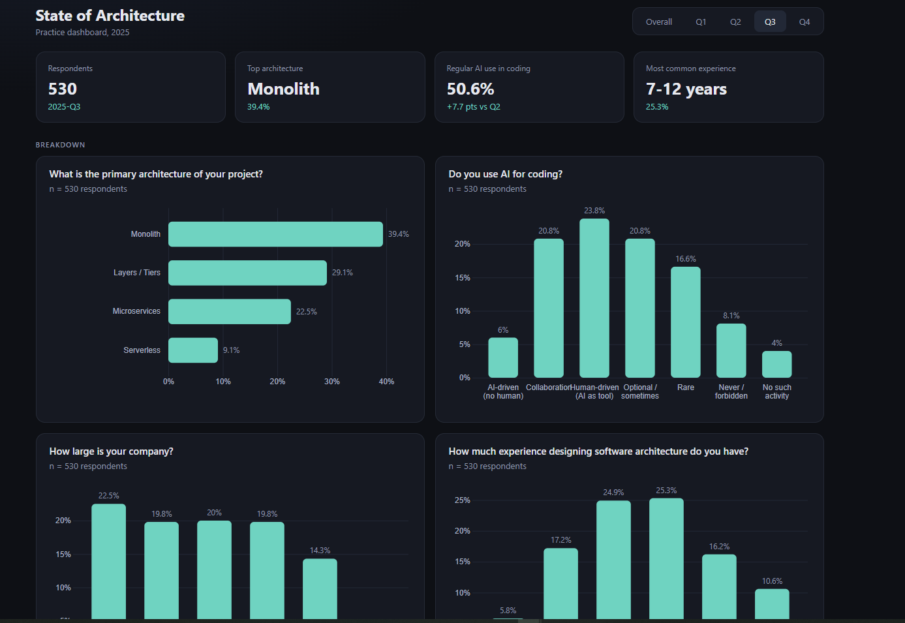
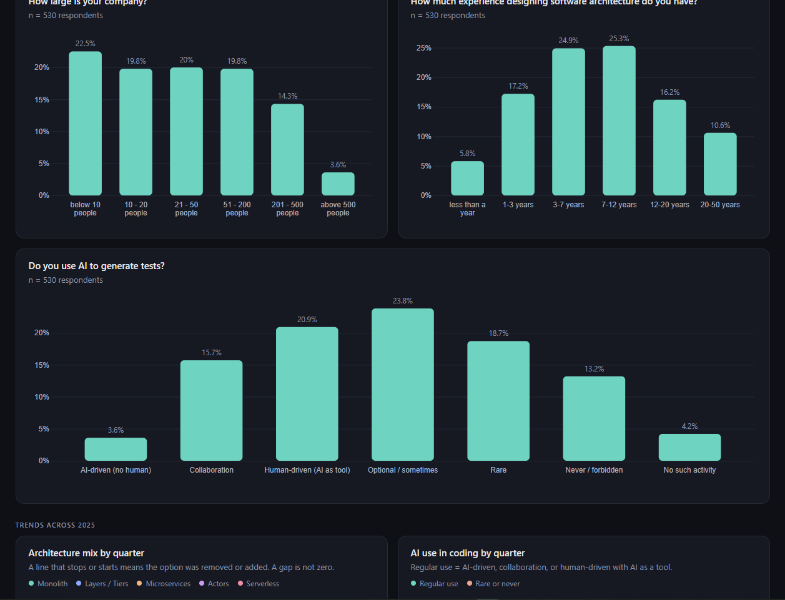
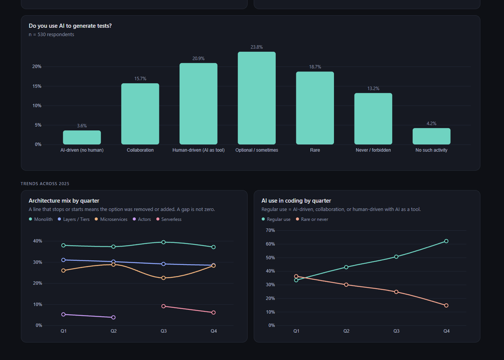

# State of Architecture Dashboard

A practice project that simulates a survey-results dashboard for a software architecture survey. It covers the full path from database to chart: MongoDB stores the survey, an Express API aggregates the answers, and a React app draws them with D3.js.


*Overall view with KPI cards, breakdown charts, and trend lines.*


*A single quarter. The AI testing question is the version that was asked in Q3.*


*The same dashboard on a phone-sized screen.*

> All survey data is randomly generated sample data. It does not come from real respondents.

## What it does

- Four quarterly survey waves for 2025 (about 2,000 fake respondents) plus an **Overall** view that combines them.
- KPI cards, bar charts, and trend lines in a responsive grid that works from phones to wide screens.
- Charts are **metadata-driven**: each question in the database says whether it is ordered, so the dashboard decides the chart (ordered answers stay in order as vertical bars, unordered ones are sorted as horizontal bars).
- Handles **questions and options that change between waves**:
  - an option renamed, keeping the same `option_id`, so the trend continues
  - an option added or removed, shown as a gap in the trend line and marked with `*` in the Overall view
  - a question whose meaning changed, given a new `question_id` and never merged with the old one
- "Not asked" is not treated as zero. Percentages in the Overall view use only the respondents who actually saw an option.
- Aggregation runs in MongoDB (`$unwind`, `$group`), so the browser receives a few numbers per question instead of every response.
- Charts are written in D3.js (scales, axes, transitions, tooltips), not a chart wrapper library.

## Tech stack

| Layer | Tools |
|---|---|
| Database | MongoDB Atlas |
| Backend | Node.js, Express |
| Frontend | React (Vite), D3.js |

## Data model

- `questions`: `question_id`, `section`, `type`, `ordered`, `options` (each with `option_id`, `label`, and the `waves` it was offered in), `parent_question_id`, `waves`
- `responses`: `respondent_id`, `wave`, `answers` (each with `question_id`, `values`, and `asked_option` for follow-up "why" questions)

## API

| Endpoint | Description |
|---|---|
| `GET /questions` | All question metadata |
| `GET /results/:question_id?wave=2025-Q1` | Counts and percentages per option. Leave out `wave` for the overall view |

## Getting started

You need Node.js 22 or newer and a free [MongoDB Atlas](https://www.mongodb.com/atlas) cluster.

1. Clone the repo and open the folder.

```
   git clone https://github.com/keddenise/survey-dashboard.git
   cd survey-dashboard
```

2. Set up the backend.

```
   cd server
   npm install
   copy .env.example .env
```

   Open `.env` and replace the placeholder with your Atlas connection string.

3. Load the sample data and start the API.

```
   node --env-file=.env seed.js
   node --env-file=.env index.js
```

   The API runs on http://localhost:3000.

4. In a second terminal, start the frontend.

```
   cd client
   npm install
   npm run dev
```

   Open http://localhost:5173.

## Project structure

```
survey-dashboard/
├── client/          React + D3 dashboard
│   └── src/
│       ├── App.jsx
│       ├── BarChartD3.jsx
│       └── LineChartD3.jsx
└── server/          Express API and seed data
    ├── index.js
    ├── questions.js
    └── seed.js
```

## Planned

- Heatmap view (for example architecture by company size) with a crosstab endpoint
- More survey sections and questions